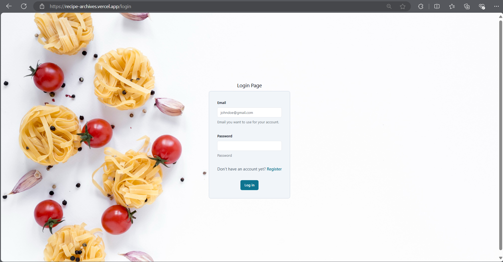
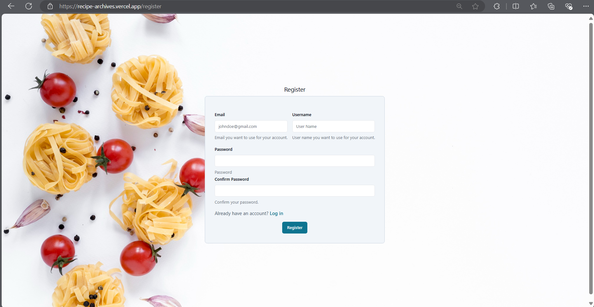
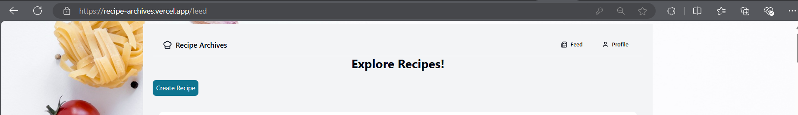

# Recipe Archives

**Recipe Archives** is a web application that enables users to discover, create, and engage with recipes from others. Acting as a collaborative cookbook, it allows users to not only share their own culinary creations but also explore a variety of recipes from the community. Users can provide feedback through reviews and ratings, fostering a space for culinary interaction and discovery.

## Features

1. **User Management**
   - Users can sign up, log in, and manage their profiles.
   - Each user has the ability to create, view, update, and delete their account information.

2. **Recipe Management**
   - Users can create and browse recipes.
   - Recipes can be edited, including details such as the name, description, ingredients, and more.
   - Users can delete their own recipes.

3. **Review System**
   - Users can leave reviews on other users' recipes.
   - Reviews can be edited or deleted, and users can also rate recipes.

4. **Feed Page**
   - Displays all user-created recipes alongside their reviews.
   - Users can create recipes, write reviews, view specific recipe or review details, and navigate to their profile.

5. **Profile Page**
   - Displays user information such as name and email.
   - Users can manage and view their own recipes and reviews.
   - Recipes and reviews can be edited or deleted from this page.

## Screenshots

### **Login and Registration**
This is the page for logging in and registering to use Recipe Archives.

- **Login:**

    

- **Register:**

    

### **Feed Page**
The Feed page allows you to view all the recipes and reviews. You can also create a new recipe or write a review from here.

- **Recipe and Review View:**
   

       
   

  
- **Navigation:**
   

       
   

- **Create Recipe:**
   

       
   

- **Upload Image:**
   

       
   

- **Create Review:**
   

       
   

- **View Recipe Detail:**
   

       
   

- **View Review Detail:**
   

       
   

### **Profile Page**
This is the page where you can view and edit your profile. You can also see all the reviews and recipes you’ve created, with options to edit or delete them.

- **Edit Profile Information:**
   

       
   

- **View All Your Recipes:**
   

       
   

- **View All Your Reviews:**
   

       
   

- **Edit Your Recipe:**
   

       
   

- **Edit Your Review:**
   

       
   

## Tech Stack

- **Frontend and Backend**: Next.js, shadcn/ui, Tailwind CSS
- **Database**: MongoDB
- **Authentication**: NextAuth.js
- **Image Upload**: Cloudinary
- **Deployment**: Vercel

## Team Members
- [Kyaw Ye Lwin @ Anmol](https://github.com/KyawYeLwin)
- [Bhone Pyae Kyaw](https://github.com/BhonePyae-Kyaw) 
- [Moe Myint Mo San](https://github.com/MoeMyintMoSan)

## References
- [NextAuth.js Documentation](https://next-auth.js.org/)
- [Cloudinary Integration with Next.js](https://next.cloudinary.dev/installation)
- [Freepik for free Background Image](https://www.freepik.com/free-photos-vectors/recipe-background)
- [Introduction to NextAuth](https://youtu.be/Aq4FstAD3iM?si=7m1f5Bep316UmQ3K)
- [Using Cloudinary in Next.js](https://youtu.be/Cm6-3pVCPEI?si=ps_0VOu6rE_ANiEw)
- [Flaticon for Icon used](https://www.flaticon.com/search?word=food)

## YouTube Video (Product Showcase)
- [Product Showcase](YOUTUBE LINK)

## Live Demo
